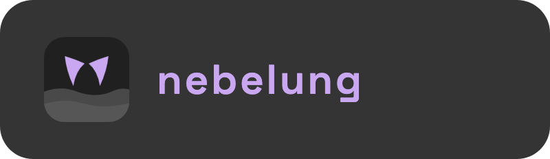
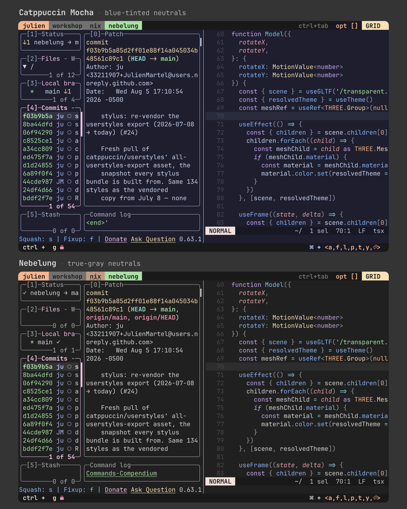

<div align="center">



**Mocha with the blue stripped out**

the theme — a silver-mist [Catppuccin](https://catppuccin.com) flavor, rendered
into 54 ports.




</div>

---

Catppuccin's entire neutral ramp (`base` → `text`) carries a single ~240° blue
hue. Nebelung does two things about it:

1. **rewrites the ramp to pure neutral grey** — chroma 0, every neutral exactly
   R = G = B, each color's perceptual lightness left identical.
2. **calms the 14 accents** — chroma ×0.9, so they sit against true grey instead
   of a slightly-blue base.

Grey is the point. Same structure, same 14 accent slots, same ports — the blue
cast is the only thing that leaves. Named for a cat breed the colour of high fog.

## why nebelung

- **it stays in sync with upstream** — built with [whiskers](https://whiskers.catppuccin.com), the palette is a `--color-overrides` file applied to the upstream flavor slot of each port's template. ports track Catppuccin; only the colors change.
- **it's generated, not hand-tuned** — one OKLCH script produces every variant. no committed hex soup to drift.
- **light mode is a real palette, not an inversion** — those two rules never mention "dark", so pointing them at Latte gives a genuine light theme.

## the variants

| variant | source | `dist/` subdir | text on base |
| --- | --- | --- | --- |
| `nebelung` | Mocha | *(the root)* | 11.3:1 |
| `nebelung-high-contrast` | Mocha | `high-contrast/` | 19.9:1 |
| `nebelung-latte` | Latte | `latte/` | 7.0:1 |
| `nebelung-latte-high-contrast` | Latte | `latte-high-contrast/` | 9.9:1 |

The default keeps the tree root, so every path that existed before variants did
still resolves. The rest nest inside it.

▶ **[open the interactive preview](https://htmlpreview.github.io/?https://github.com/hausfold/nebelung/blob/main/preview/nebelung.html)**
— live swatch board plus editor and terminal mockups. One per variant;
[`nebelung-latte.html`](preview/nebelung-latte.html) is light mode.

## install

Every port is the same two moves: **drop a rendered file, name it in a config.**
Ghostty, start to finish:

```bash
git clone --depth 1 https://github.com/hausfold/nebelung
mkdir -p ~/.config/ghostty/themes
cp nebelung/dist/ghostty/themes/catppuccin-mocha.conf ~/.config/ghostty/themes/
echo 'theme = catppuccin-mocha' >> ~/.config/ghostty/config
```

Reload Ghostty (`cmd+shift+,`) and you're in Nebelung. The file keeps its
upstream **Catppuccin** name on purpose: Nebelung renders into the flavor slot
each template already has, so `catppuccin-mocha` *is* the Nebelung theme.
Nothing else about the port changes.

### picking a variant

Variants nest under their own `dist/` subdir and are named after the catppuccin
flavor they rendered as — light mode is `catppuccin-latte`:

```bash
cp nebelung/dist/latte-high-contrast/ghostty/themes/catppuccin-latte.conf \
   ~/.config/ghostty/themes/
echo 'theme = catppuccin-latte' >> ~/.config/ghostty/config
```

### as a flake

Consuming the flake skips the copying — that's how the rice themes everything:

```nix
inputs.nebelung.url = "github:hausfold/nebelung";
```

```nix
# in a home-manager module — the rendered file, straight out of the store
xdg.configFile."ghostty/themes/catppuccin-mocha.conf".source =
  "${nebelung.packages.${pkgs.system}.default}/ghostty/themes/catppuccin-mocha.conf";

# or the raw colors, for configs Nix generates itself
programs.starship.settings.palettes.nebelung = nebelung.palette;

# variants are data, not paths to guess — this one is
# { dir = "latte-high-contrast"; flavor = "latte"; }
lightTheme = with nebelung.variants."nebelung-latte-high-contrast";
  "${nebelung.packages.${pkgs.system}.default}/${dir}/ghostty/themes/catppuccin-${flavor}.conf";
```

[Nix outputs in full](docs/nix.md) — `palette`, `palettes`, `variants`, `ports`,
`checks`.

### build it yourself

```bash
./build.sh             # regenerate palette + render all ports → dist/
./build.sh --no-gen    # render only (palette unchanged)
```

Needs [`whiskers`](https://whiskers.catppuccin.com)
(`brew install catppuccin/tap/whiskers`) and Node for the palette generator.

## the ports

- **terminals** — Ghostty · Kitty · Alacritty · Rio · Warp · foot · Konsole · Tabby · Xresources
- **shell + prompt** — Starship · fish · zsh-syntax-highlighting · zsh-fsh · fzf · skim
- **multiplexers** — Zellij · tmux
- **editors** — Helix · Zed · Emacs · Kakoune · micro · Sublime Text · JetBrains · Xcode · VS Code / Cursor
- **git** — delta · lazygit · gitui · gh-dash
- **cli + tui** — bat · lsd · yazi · glow · btop · bottom · k9s · mpv · spotify-player · sc-im · tty
- **apps** — Slack · Telegram · Zen · Obsidian · opencode · Raycast · OBS · zathura · qBittorrent · Dark Reader · Stylus · chroma
- **web** — CSS custom properties · Tailwind v4

Each renders into `dist/<port>/`, per variant. Every output path, the setting
that makes it active, and how much of that a config manager can do for you —
**auto** (all of it), **activate** (the app rewrites its own theme setting, so it
needs an idempotent patch), **manual** (you paste or click) — are in the
[full ports table](docs/ports.md), generated from
[`ports.meta.json`](ports.meta.json) and exposed as the flake's `ports` output.

### on the web

The `css` port is the odd one out: there's no app to point at a file, you just
import it. Two shapes per variant, take one — plain custom properties, or a
Tailwind v4 `@theme` (v4 has no JS config; a theme *is* CSS).

```css
/* any stylesheet → var(--nebelung-mauve), var(--nebelung-accent), … */
@import url("nebelung-mocha.css");

/* …or Tailwind v4 → bg-nebelung-base, text-nebelung-mauve, … */
@import "tailwindcss";
@import "./nebelung-mocha.tailwind.css";
```

Light + dark from one sheet: import each flavor behind its own media query, so
only one of them ever defines `:root`. They render into sibling dirs —
`dist/css/` and `dist/latte/css/` — so copy both out and the paths are yours.

```css
@import url("nebelung-mocha.css") (prefers-color-scheme: dark);
@import url("nebelung-latte.css") (prefers-color-scheme: light);
```

**Missing a port Catppuccin has?** [Open an issue](https://github.com/hausfold/nebelung/issues/new)
or a PR — anything with a [whiskers](https://whiskers.catppuccin.com) template is
about three lines to add.

## more

- [Ports](docs/ports.md) — every output path and how to install it
- [Nix](docs/nix.md) — flake outputs (`palette`, `palettes`, `variants`, `checks`)
- [Palette internals](docs/palette.md) — repo layout, tuning knobs, and why the two contrast boosts differ
- [Theming & accents](https://nebelhaus.com/guides/theming/) — picking an accent inside the rice

## the family

- 🏠 [**nebelhaus**](https://github.com/hausfold/hausfold) — the house. the whole rice, one Nix flake. start here.
- 🐾 [**pounce**](https://github.com/hausfold/pounce) — the palette. keyboard-first launcher; every command a file.
- 🪺 [**perch**](https://github.com/hausfold/perch) — the shelf. files, caught in the notch.
- 🌫️ [**nebelung**](https://github.com/hausfold/nebelung) — the theme. the silver-mist palette. *(you are here)*
- 🧰 [**workshop**](https://github.com/hausfold/workshop) — the bench. where the family is built.

Each one stands alone. Together they're a house.

## license

MIT © hausfold
