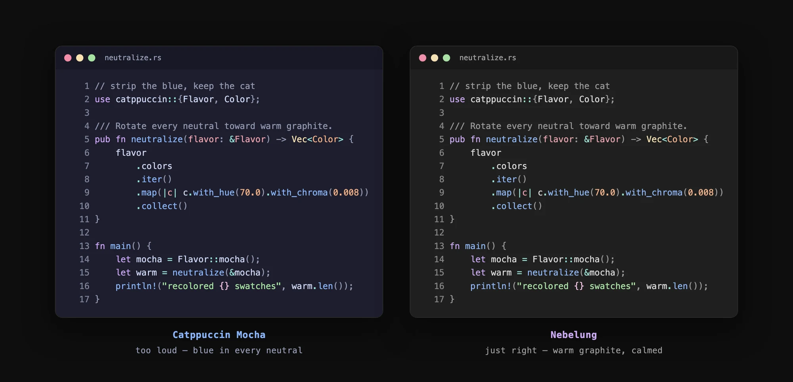

<div align="center">


**Mocha with the blue stripped out**

the theme — a silver-mist [Catppuccin](https://catppuccin.com) flavor, rendered
into 22 ports.




</div>

---

Catppuccin's entire neutral ramp (`base` → `text`) carries a single ~240° blue
hue. Nebelung does two things about it:

1. **rewrites the ramp to pure neutral grey** — chroma 0, every neutral exactly
   R = G = B, each color's perceptual lightness left identical.
2. **calms the 14 accents** — chroma ×0.9, so they sit against true grey instead
   of a slightly-blue base.

Grey is the point. It's a low-contrast, muted palette for people who find Mocha
too loud — named for a cat breed the colour of high fog.

## why nebelung

- **it stays in sync with upstream** — built with [whiskers](https://whiskers.catppuccin.com), the palette is a `--color-overrides` file applied to the upstream flavor slot of each port's template. ports track Catppuccin; only the colors change.
- **it's generated, not hand-tuned** — one OKLCH script produces every variant. no committed hex soup to drift.
- **light mode is a real palette, not an inversion** — those two rules never mention "dark", so pointing them at Latte gives a genuine light theme.

## the variants

| variant | source | `dist/` subdir | text on base |
| --- | --- | --- | --- |
| `nebelung` | Mocha | *(the root)* | 11.3:1 |
| `nebelung-high-contrast` | Mocha | `high-contrast/` | 19.9:1 |
| `nebelung-latte` | Latte | `latte/` | 7.0:1 |
| `nebelung-latte-high-contrast` | Latte | `latte-high-contrast/` | 9.9:1 |

The default keeps the tree root, so every path that existed before variants did
still resolves. The rest nest inside it.

▶ **[open the interactive preview](https://htmlpreview.github.io/?https://github.com/nebelhaus/nebelung/blob/main/preview/nebelung.html)**
— live swatch board plus editor and terminal mockups. One per variant;
[`nebelung-latte.html`](preview/nebelung-latte.html) is light mode.

## install

Consuming the flake is the easy path — that's how the rice themes everything:

```nix
inputs.nebelung.url = "github:nebelhaus/nebelung";
```

Or build the `dist/` tree and copy what you want by hand:

```bash
./build.sh             # regenerate palette + render all ports → dist/
./build.sh --no-gen    # render only (palette unchanged)
```

Needs [`whiskers`](https://whiskers.catppuccin.com)
(`brew install catppuccin/tap/whiskers`) and Node for the palette generator.

## the ports

Ghostty · Kitty · Alacritty · Starship · Zellij · btop · tmux · bat · delta ·
fzf · lsd · yazi · lazygit · glow · zsh-syntax-highlighting · Slack · Zen ·
Obsidian · opencode · VS Code / Cursor · Stylus

Each renders into `dist/<port>/`, per variant. Paths and per-port install steps
are in [`docs/ports.md`](docs/ports.md).

## more

- [Ports](docs/ports.md) — every output path and how to install it
- [Nix](docs/nix.md) — flake outputs (`palette`, `palettes`, `variants`, `checks`)
- [Palette internals](docs/palette.md) — repo layout, tuning knobs, and why the two contrast boosts differ
- [Theming & accents](https://nebelhaus.com/guides/theming/) — picking an accent inside the rice

## the family

- 🏠 [**nebelhaus**](https://github.com/nebelhaus/nebelhaus) — the house. the whole rice, one Nix flake. start here.
- 🐾 [**pounce**](https://github.com/nebelhaus/pounce) — the palette. keyboard-first launcher; every command a file.
- 🐦 [**trill**](https://github.com/nebelhaus/trill) — the messages. native iMessage/SMS/RCS, read from `chat.db`.
- 🪺 [**perch**](https://github.com/nebelhaus/perch) — the shelf. files, caught in the notch.
- 🌫️ [**nebelung**](https://github.com/nebelhaus/nebelung) — the theme. the silver-mist palette. *(you are here)*
- 🧰 [**workshop**](https://github.com/nebelhaus/workshop) — the bench. where the family is built.

Each one stands alone. Together they're a house.

## license

MIT © nebelhaus
