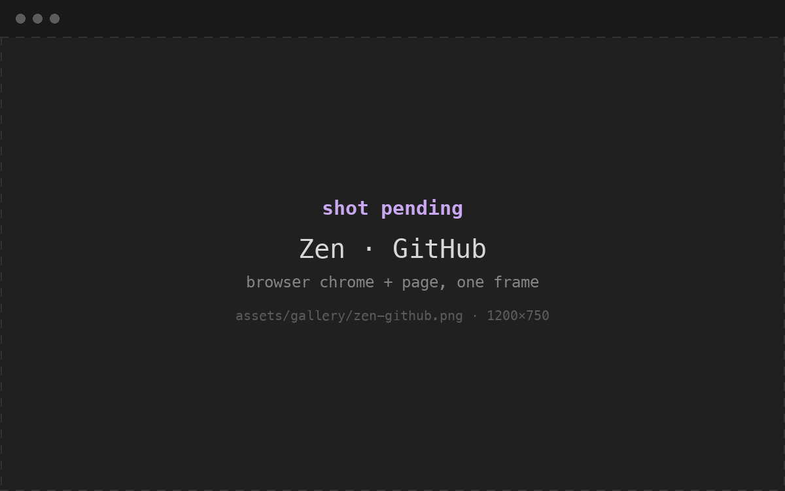
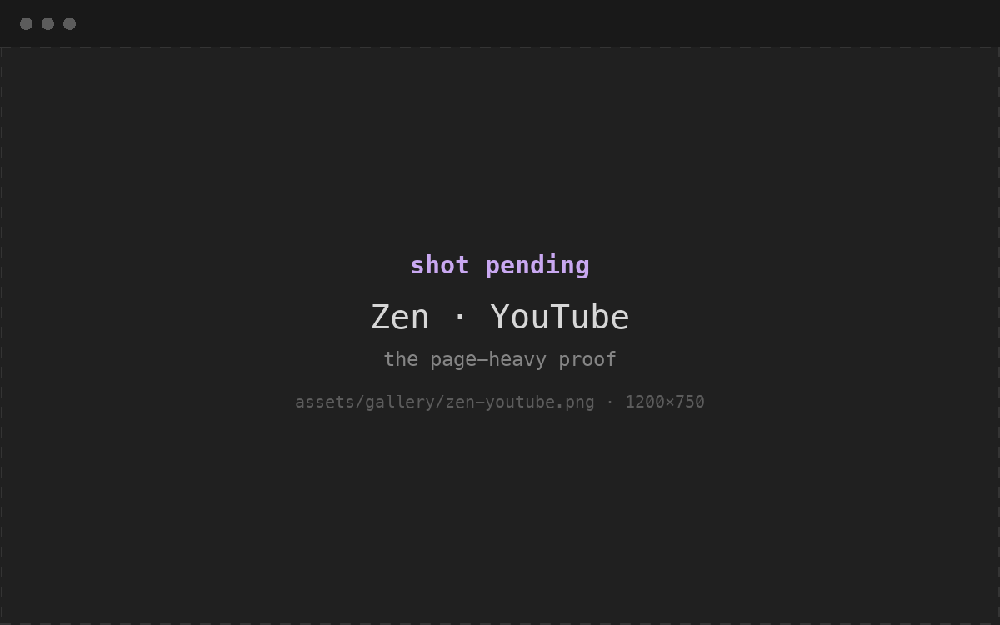
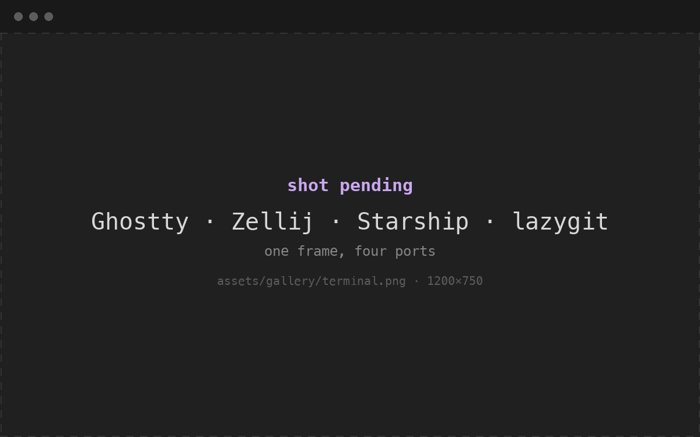
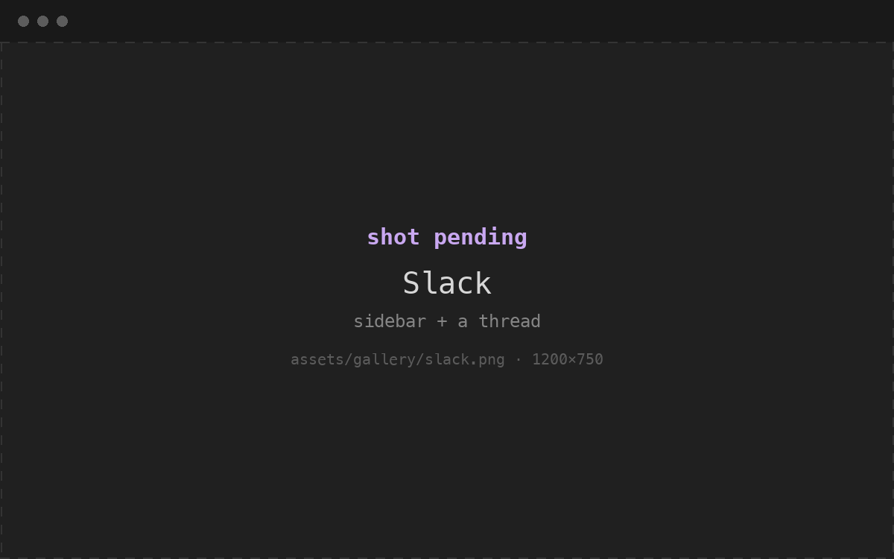
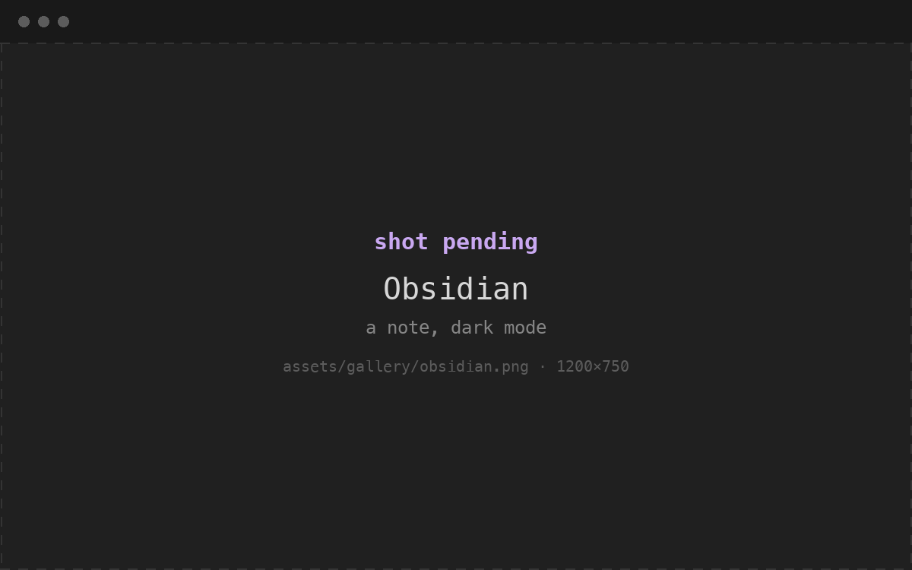

# nebelung in use

Five shots — the ports you can't judge from a hex list. Everything colour-level
(the ramp, the accents, every variant side by side) is in the
[preview](https://hausfold.github.io/nebelung/preview/), which is generated and
always current; this page is the part that needs a human with the app open.

Shots are the default `nebelung` variant (Mocha) unless a caption says otherwise.

## the browser

GitHub through [Zen](ports.md#p-zen) and [Stylus](ports.md#p-stylus) — the browser
chrome and the page are two different ports, which is why this is one frame and not
two. Zen colours the tab strip, sidebar and URL bar from `userChrome.css`; the page
itself is a Stylus userstyle.

Same two ports on a page that fights back — YouTube is the one that shows whether
the surface ramp holds up under someone else's thumbnails.

## the terminal

Four ports in one frame: [Ghostty](ports.md#p-ghostty) draws the 16 colours,
[Zellij](ports.md#p-zellij) the pane frames and status bar,
[Starship](ports.md#p-starship) the prompt, [lazygit](ports.md#p-lazygit) the
diff. The terminals shelf is ten ports wide but they all render the same sixteen
values, so one of them stands in for the rest.

## the apps

[Slack](ports.md#p-slack) — a paste-a-string port: eight hexes into
Preferences ▸ Themes. Slack only lets you colour the sidebar, so this is the whole
of what the port can do.

[Obsidian](ports.md#p-obsidian) — a full theme folder, so unlike Slack it reaches
the editor, headings and code blocks. Dark mode; the theme renders for light too,
but Obsidian's own light defaults leak through more.

## what isn't here

Deliberately, not by omission:

- **the other terminals, and every TUI** — Kitty, Alacritty, btop, yazi, bat,
  delta and friends. They're all the same sixteen colours in a different frame, and
  a wall of near-identical screenshots teaches less than the
  [preview](https://hausfold.github.io/nebelung/preview/) does. These are the ones
  worth auto-generating later ([VHS](https://github.com/charmbracelet/vhs) tapes in
  CI, keyed on the palette + template hash) — a job for its own PR, not a photo
  shoot.
- **the licence- and login-gated apps** — Xcode, JetBrains, Raycast, Warp. Each
  needs a logged-in machine to shoot and a re-shoot every time that app's own UI
  moves, which is churn this repo doesn't need to carry.

## missing a shot?

If you add a port with a UI worth seeing, this page needs a frame for it — see the
*Add a themed tool* note in [AGENTS.md](../AGENTS.md). Shots go in
`assets/gallery/` at 1200×750, named after the port.
